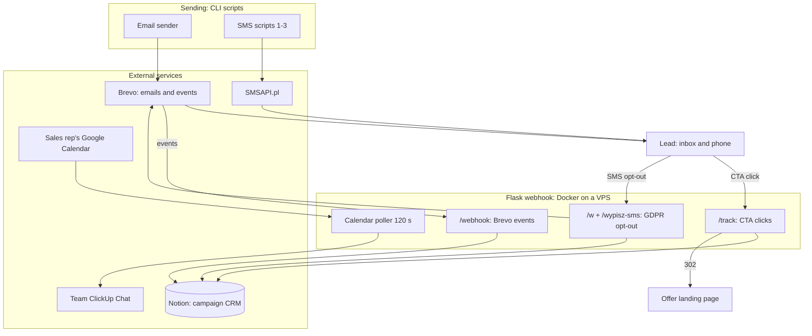

<p align="center"></p>
<h1 align="center">Activation Campaign Engine</h1>
<h3 align="center">Activates a cold list with an email and SMS sequence, tracks clicks in CRM, and alerts the team on every new meeting booking</h3>

<p align="center">
  
  
  
  
  
  
</p>

## Table of contents

- [About](#about)
- [Screenshots](#screenshots)
- [Source code](#source-code)
- [Stack](#stack)
- [Features](#features)
- [Architecture](#architecture)
- [Statistics](#statistics)
- [My role](#my-role)
- [Contact](#contact)

---

## About

Reactivating a cold list is not a sending problem. It is a measurement and sales handoff problem. Your email platform tells you how many people opened a message, but not that this specific person clicked the "website for 1 PLN" offer and that you should call them today. Without that, the sales team reacts too late or not at all.

The system closes the loop: 8 emails and 3 SMS messages to a base of ~3000 contacts. A click on an offer records the date and offer name in the campaign CRM (Notion), then the lead lands on the landing page. A separate channel collects deliveries, opens, bounces and unsubscribes from the email platform, but only from this campaign, so data from other sends on the same account never mixes in. The second SMS goes only to people who opened at least one email. SMS opt-out requires a confirmation page first; only then does the contact land on the blacklist.

The campaign ran for one month (Dec 15, 2025 - Jan 15, 2026), solo. The system measured hard numbers: a 43% unique open rate (1325 people from a 3106-contact base), 150 unique clickers and 92.9% deliverability across 6,683 SMS messages. The bottom of the funnel, from CRM statuses and the calendar: 41 bookings (zero cancellations), 40 meetings booked, 6 proposals made and 3 purchases. Against the 15-28% average for B2B cold email, the 43% open rate lands in the industry's top decile.

---

## Screenshots

| First campaign email: four offers to click | Follow-up SMS (phone mockup) |
|:---:|:---:|
|  |  |

| Campaign CRM: opens, per-offer clicks, opt-outs | Team alert after a meeting booking |
|:---:|:---:|
|  |  |

| SMS opt-out confirmation (GDPR) | Campaign results: full sales funnel |
|:---:|:---:|
|  |  |

> **Note:** frames come from template renders and mocks with fictional data, not from customer inboxes or databases. The campaign brand is anonymized.

---

## Source code

The code is private and confidential. This repository is a project showcase: description, architecture and screenshots.

---

## Stack

```
Sending (CLI scripts)
Python 3.11                        // email sending + 2 SMS scripts
Brevo v3                           // templates, transactional email, blacklists
SMSAPI.pl                          // SMS, retry on insufficient credits, balance check

Webhook (Docker on a VPS)
Flask 3.0 + Gunicorn 21.2          // 2 workers x 4 threads, 7 endpoints
/track /webhook /w /wypisz-sms     // CTA clicks, Brevo events, SMS opt-out

Data and integrations
Notion API 2022-06-28              // campaign CRM: per-email dates, per-offer clicks
Google Calendar v3                 // poll every 120 s, only events with ORD codes
ClickUp Chat v3                    // new booking notification (markdown)

Ops
Docker Compose · Hetzner VPS · Nginx + Certbot
```

---

## Features

### Sequence

- **8 emails + 3 SMS in 31 days** - escalating offers: free consultation, a website for 1 PLN, a free month of service, an ads audit, 10 guaranteed leads, 72h and 24h FOMO
- **SMS 2 only for openers** - segment built from CRM data, not from the email platform's aggregate stats
- **Blacklists before sending** - blocked contacts excluded before every batch, so opted-out people never receive another message
- **SMS without Polish diacritics** - lower sending cost; retries on insufficient credits and a balance check before each run

### Tracking and CRM

- **Per-offer click tracking** - 6 offers, date saved in CRM, then redirect to the landing page (custom `/track` endpoint)
- **Guards against bad writes** - empty email, unsubstituted placeholder or unknown offer: redirect without a CRM entry
- **Email platform events** - deliveries, opens, bounces and unsubscribes; a campaign filter cuts off events from other sends
- **Notion as campaign CRM** - delivery and open columns (1-8), clicks per offer, opt-outs, contact quality score 1-5
- **Safe record creation** - a second contact check before creation, so parallel events never create duplicates

### GDPR and opt-outs

- **Two-step SMS opt-out** - confirmation page first, blacklist write only after; protection against bots and accidental taps
- **Consistent blacklist** - SMS opt-out blocks further SMS and drops contact quality; email opt-out goes through the email platform's own mechanism

### Team handoff

- **Calendar monitoring** - check every 2 minutes, 5-minute window, 30-day horizon
- **Customer bookings only** - filter by booking codes in the event title, skip when a salesperson is an attendee
- **No duplicate notifications** - deduplication of processed bookings and a lock between server workers
- **Team chat alert** - message with a link to the CRM view holding the new lead (ClickUp Chat)

---

## Architecture



---

## Statistics

### Technical complexity

| Metric | Value |
|---|---|
| **Commits** | 21, single author |
| **Backend** | 1541 LOC Python, 4 files |
| **HTTP endpoints** | 7 |
| **Templates** | 8 HTML emails + 3 SMS |
| **Docker services** | 1 (webhook, Gunicorn 2x4) |
| **API integrations** | 5 (Brevo, SMSAPI, Notion, Google Calendar, ClickUp) |

### Campaign results (Dec 15, 2025 - Jan 15, 2026)

| Metric | Value |
|---|---|
| **Unique open rate** | 43% (1325 of 3106 contacts) |
| **Unique clickers** | 150 (11.3% of openers; 253 total CTA clicks) |
| **Calendar bookings** | 41 (ORD codes, zero cancellations) |
| **Meetings booked** | 40 (CRM status) |
| **Proposals made** | 6 (CRM status) |
| **Purchases** | 3 (CRM status) |
| **Deferred demand** | 11 "future prospect" contacts (CRM status) |
| **Cost per booking** | ~89 PLN (~$22; total budget ~3,650 PLN incl. labor) |
| **SMS deliverability** | 92.9% (6,683 sent) |
| **Sending scale** | 20,643 delivered emails (8 in sequence) + 3 SMS in 31 days |

### Results vs B2B cold email benchmarks

| Metric | This campaign | Market benchmark |
|---|---|---|
| **Unique open rate** | 43% | 15-28% average; result in the industry top 10% |
| **CTOR: clicks from opens** | 11.3% | 5.3-6.8% average (HubSpot, MailerLite) |
| **Click → meeting booking** | 27% | 8-15% for "book a meeting" CTAs (Gong Labs) |
| **Cost per lead** | ~89 PLN (~$22) | $44-84 (~175-340 PLN) |
| **SMS deliverability** | 92.9% | 90-95% norm |

> Campaign numbers from system measurement and CRM: Brevo webhook, custom `/track`, SMSAPI reports, Google Calendar export, Notion statuses. Re-verified on Sep 1, 2026. Benchmarks: aggregated analysis of 80+ B2B cold email sources (HubSpot, MailerLite, Gong Labs, Digital Bloom and others), Jan 2026.

---

## My role

All the code, integrations, sending and the campaign report are mine (sole commit author). The campaign ran under the team's own brand, which is why the brand in the frames is anonymized.

---

## Contact

| Platform | Link |
|---|---|
| **WWW** | [kamilkaczmareksolutions.com](https://kamilkaczmareksolutions.com) |
| **GitHub** | [kamilkaczmareksolutions](https://github.com/kamilkaczmareksolutions) |
| **LinkedIn** | [Kamil Kaczmarek](https://www.linkedin.com/in/kamilkaczmareksolutions) |
| **Email** | [recruitment@kamilkaczmareksolutions.com](mailto:recruitment@kamilkaczmareksolutions.com) |

---

**Activation Campaign Engine** - from a cold list straight into the sales rep's calendar.

<p align="center"><em>Built by Kamil Kaczmarek</em></p>
