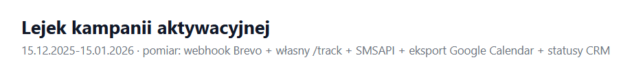
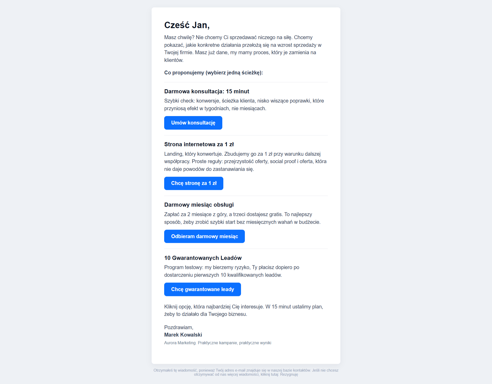
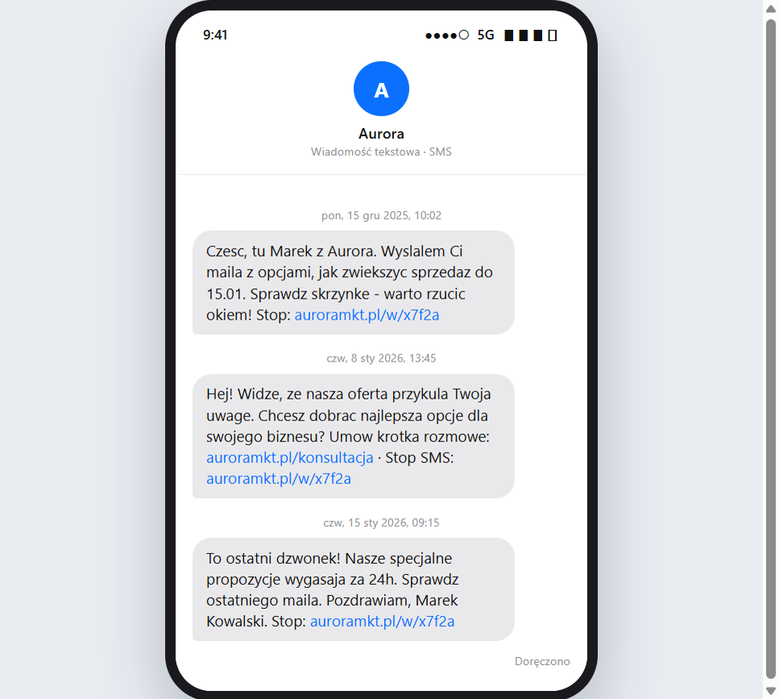
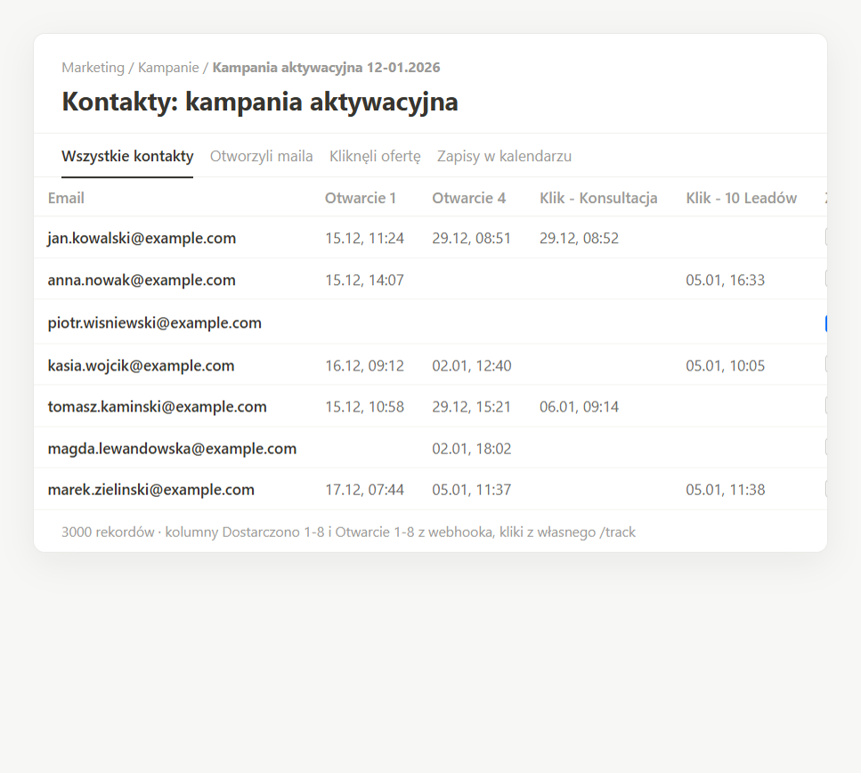
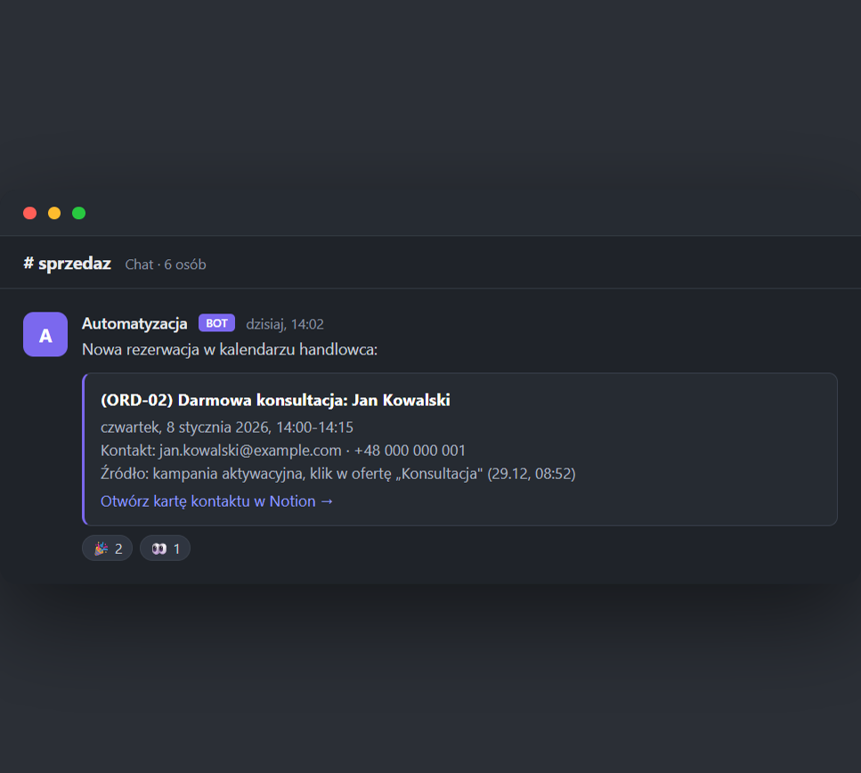
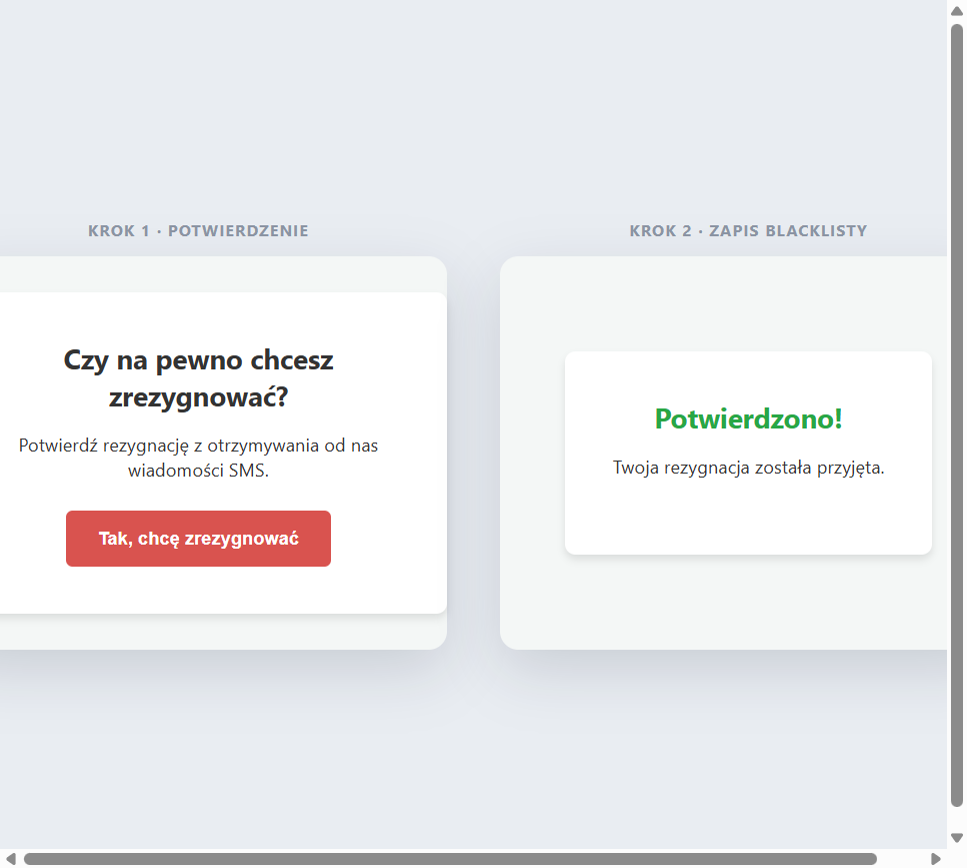
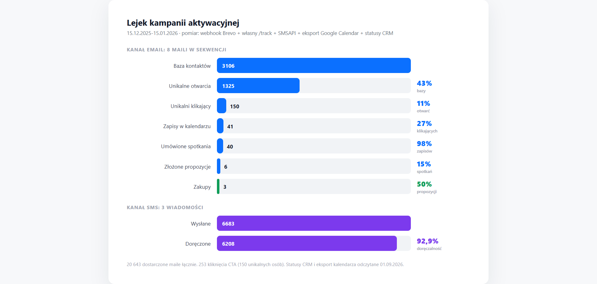
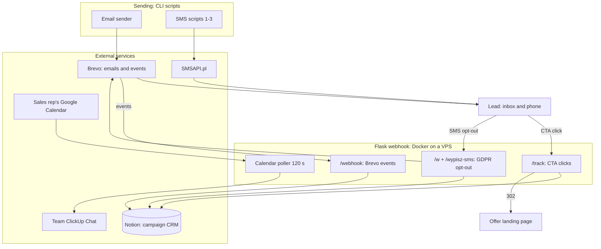

<p align="center"></p>
<h1 align="center">Activation Campaign Engine</h1>
<h3 align="center">A sequence of 8 emails and 3 SMS messages with custom click tracking, Notion as the campaign CRM, and an automation that pings the team on every new calendar booking</h3>

<p align="center">
  
  
  
  
  
  
</p>

## Table of contents

- [About](#about)
- [Screenshots](#screenshots)
- [Source code](#source-code)
- [Stack](#stack)
- [Features](#features)
- [Architecture](#architecture)
- [Statistics](#statistics)
- [My role](#my-role)
- [Contact](#contact)

---

## About

Reactivating a cold list is not a sending problem, it is a measurement and handoff problem. Your email tool tells you how many people opened the message, but it does not tell the salesperson that this specific person clicked the "10 leads" offer and should get a call today. This system closes that loop: a sequence of 8 emails and 3 SMS messages to a base of ~3000 contacts, custom per-offer click tracking, Notion as the campaign CRM, and an automatic ping to the team chat whenever a lead books a calendar slot.

A CTA click hits a custom `/track` endpoint, which writes the timestamp to the right offer column in Notion and only then redirects to the landing page. A Brevo webhook adds deliveries, opens, bounces and unsubscribes, filtered by `template_id` so events from other campaigns on the same account never pollute the data. The second SMS goes only to people who opened at least one email. SMS opt-out is two-step: a confirmation page first, the blacklist write only after.

The campaign ran for one month (Dec 15, 2025 - Jan 15, 2026), solo. The system measured hard numbers: a 43% unique open rate (1325 people from a 3106-contact base), 150 unique clickers and 92.9% deliverability across 6,683 SMS messages. The bottom of the funnel, from CRM statuses and the calendar: 41 bookings (zero cancellations), 40 meetings booked, 6 proposals made and 3 purchases. Against the 15-28% average for B2B cold email, the 43% open rate lands in the industry's top decile.

---

## Screenshots

| Email 01 from the sequence: 4 CTA offers | Campaign SMS (phone mock) |
|:---:|:---:|
|  |  |

| Notion as CRM: opens, per-offer clicks, opt-outs | Team notification after a calendar booking |
|:---:|:---:|
|  |  |

| Two-step SMS opt-out (GDPR) | Campaign results: system-measured |
|:---:|:---:|
|  |  |

> **Note:** frames come from template renders and mocks with fictional data, not from customer inboxes or databases. The campaign brand is anonymized.

---

## Source code

The code is private and confidential. This repository is a project showcase: description, architecture and screenshots.

---

## Stack

```
Sending (CLI scripts)
Python 3.11                        // email sending + 2 SMS scripts
Brevo v3                           // templates, transactional email, blacklists
SMSAPI.pl                          // SMS, retry on insufficient credits, balance check

Webhook (Docker on a VPS)
Flask 3.0 + Gunicorn 21.2          // 2 workers x 4 threads, 7 endpoints
/track /webhook /w /wypisz-sms     // CTA clicks, Brevo events, SMS opt-out

Data and integrations
Notion API 2022-06-28              // campaign CRM: per-email dates, per-offer clicks
Google Calendar v3                 // poll every 120 s, only events with ORD codes
ClickUp Chat v3                    // new booking notification (markdown)

Ops
Docker Compose · Hetzner VPS · Nginx + Certbot
```

---

## Features

### Sequence

- **8 emails + 3 SMS in 31 days** - escalating offers: free consultation, a website for 1 PLN, a free month of service, an ads audit, 10 guaranteed leads, 72h and 24h FOMO
- **SMS 2 only to openers** - segment computed from Notion open columns, not from Brevo stats
- **Blacklists before sending** - contact attribute plus the full blockedContacts list before every batch
- **SMS without Polish diacritics** - cheaper multipart; retry on insufficient credits (10/20/30 s) and balance check before each run

### Tracking and CRM

- **Custom per-offer `/track`** - 6 offers, click timestamp in a Notion column, then a 302 to the landing page
- **Input guards** - empty email, unsubstituted Brevo placeholder (`{{...}}`), unknown offer: redirect without a write
- **Brevo webhook** - delivered / opened / bounce / unsubscribed; a `template_id` filter cuts off events from other campaigns on the same account
- **Notion as CRM** - Delivered and Opened columns 1-8, one Click column per offer, opt-out checkboxes, 1-5 contact quality score
- **Race-safe create** - a second contact lookup right before creation, so parallel events never create duplicates

### GDPR and opt-outs

- **Two-step SMS opt-out** - GET shows a confirmation page, only POST writes: protection against bots and accidental taps
- **Consistent blacklist** - SMS opt-out sets `smsBlacklisted` in Brevo and drops contact quality to 1; email opt-out goes through Brevo's own mechanism

### Team handoff

- **Calendar poll every 120 s** - 5-minute `updatedMin` window, 30-day horizon, service account
- **Customer bookings only** - filter by (ORD-01..05) codes in the title, skip when an attendee is a salesperson
- **No duplicates** - processed-ID dedup (max 500) plus an `fcntl` lock, so two gunicorn workers never send the same notification twice
- **ClickUp Chat** - markdown message with a link to the Notion view holding the new lead

---

## Architecture



---

## Statistics

### Technical complexity

| Metric | Value |
|---|---|
| **Commits** | 21, single author |
| **Backend** | 1541 LOC Python, 4 files |
| **HTTP endpoints** | 7 |
| **Templates** | 8 HTML emails + 3 SMS |
| **Docker services** | 1 (webhook, Gunicorn 2x4) |
| **API integrations** | 5 (Brevo, SMSAPI, Notion, Google Calendar, ClickUp) |

### Campaign results (Dec 15, 2025 - Jan 15, 2026)

| Metric | Value |
|---|---|
| **Unique open rate** | 43% (1325 of 3106 contacts) |
| **Unique clickers** | 150 (11.3% of openers; 253 total CTA clicks) |
| **Calendar bookings** | 41 (ORD codes, zero cancellations) |
| **Meetings booked** | 40 (CRM status) |
| **Proposals made** | 6 (CRM status) |
| **Purchases** | 3 (CRM status) |
| **Deferred demand** | 11 "future prospect" contacts (CRM status) |
| **Cost per booking** | ~89 PLN (~$22; total budget ~3,650 PLN incl. labor) |
| **SMS deliverability** | 92.9% (6,683 sent) |
| **Sending scale** | 20,643 delivered emails (8 in sequence) + 3 SMS in 31 days |

### Results vs B2B cold email benchmarks

| Metric | This campaign | Market benchmark |
|---|---|---|
| **Unique open rate** | 43% | 15-28% average; result in the industry top 10% |
| **CTOR: clicks from opens** | 11.3% | 5.3-6.8% average (HubSpot, MailerLite) |
| **Click → meeting booking** | 27% | 8-15% for "book a meeting" CTAs (Gong Labs) |
| **Cost per lead** | ~89 PLN (~$22) | $44-84 (~175-340 PLN) |
| **SMS deliverability** | 92.9% | 90-95% norm |

> Campaign numbers from system measurement and CRM: Brevo webhook, custom `/track`, SMSAPI reports, Google Calendar export, Notion statuses. Re-verified on Sep 1, 2026. Benchmarks: aggregated analysis of 80+ B2B cold email sources (HubSpot, MailerLite, Gong Labs, Digital Bloom and others), Jan 2026.

---

## My role

All the code, integrations, sending and the campaign report are mine (sole commit author). The campaign ran under the team's own brand, which is why the brand in the frames is anonymized.

---

## Contact

| Platform | Link |
|---|---|
| **WWW** | [kamilkaczmareksolutions.com](https://kamilkaczmareksolutions.com) |
| **GitHub** | [kamilkaczmareksolutions](https://github.com/kamilkaczmareksolutions) |
| **LinkedIn** | [Kamil Kaczmarek](https://www.linkedin.com/in/kamilkaczmareksolutions) |
| **Email** | [recruitment@kamilkaczmareksolutions.com](mailto:recruitment@kamilkaczmareksolutions.com) |

---

**Activation Campaign Engine** - from a cold list straight into the sales rep's calendar.

<p align="center"><em>Built by Kamil Kaczmarek</em></p>
