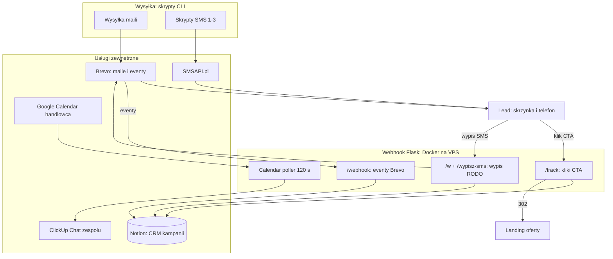

<p align="center"></p>
<h1 align="center">Silnik Kampanii Aktywacyjnych</h1>
<h3 align="center">Sekwencja 8 maili i 3 SMS-ów z własnym trackingiem kliknięć, Notion w roli CRM i automatykiem, który zgłasza zespłowi każdy nowy zapis w kalendarzu</h3>

<p align="center">
  
  
  
  
  
  
</p>

## Spis treści

- [O projekcie](#o-projekcie)
- [Screenshoty](#screenshoty)
- [Kod źródłowy](#kod-źródłowy)
- [Stack](#stack)
- [Funkcje](#funkcje)
- [Architektura](#architektura)
- [Statystyki](#statystyki)
- [Moja rola](#moja-rola)
- [Kontakt](#kontakt)

---

## O projekcie

Aktywacja zimnej bazy to nie problem wysyłki, tylko pomiaru i handoffu. Narzędzie mailingowe powie Ci, ile osób otworzyło maila, ale nie powie handlowcowi, że ta konkretna osoba kliknęła ofertę "10 leadów" i trzeba do niej zadzwonić dziś. Ten system domyka tę pętlę: sekwencja 8 maili i 3 SMS-ów na bazie ok. 3000 kontaktów, własny tracking kliknięć per oferta, Notion jako CRM kampanii i automatyczny sygnał na czacie zespołu, gdy lead zapisze się w kalendarzu.

Kliknięcie w CTA maila trafia na własny endpoint `/track`, który zapisuje datę przy właściwej ofercie w Notion i dopiero potem przekierowuje na landing. Webhook Brevo dokłada dostarczenia, otwarcia, bounce'y i wypisy, z filtrem po `template_id`, żeby eventy innych kampanii na tym samym koncie nie brudziły danych. Drugi SMS idzie wyłącznie do osób, które otworzyły któregoś z maili. Wypis z SMS-ów jest dwukrokowy: najpierw strona potwierdzenia, dopiero potem zapis blacklisty.

Kampania poszła w miesiąc (15.12.2025-15.01.2026), jedna osoba. System zmierzył twardo: 43% unikalnych otwarć (1325 osób z bazy 3106), 150 unikalnych klikających i 92,9% doręczalności przy 6683 SMS-ach. Dół lejka ze statusów CRM i kalendarza: 41 zapisów na rozmowy (zero odwołań), 40 umówionych spotkań, 6 złożonych propozycji i 3 zakupy. Przy średniej 15-28% dla cold emaili B2B wynik 43% ląduje w górnej dziesiątce branży.

---

## Screenshoty

| Mail 01 z sekwencji: 4 oferty CTA | SMS kampanii (mock telefonu) |
|:---:|:---:|
|  |  |

| Notion jako CRM: otwarcia, kliki per oferta, wypisy | Powiadomienie zespołu po zapisie w kalendarzu |
|:---:|:---:|
|  |  |

| Dwukrokowy wypis SMS (RODO) | Wyniki kampanii: pomiar systemowy |
|:---:|:---:|
|  |  |

> **Nota:** kadry pochodzą z renderu szablonów i mocków na fikcyjnych danych, nie ze skrzynek ani baz klientów. Marka kampanii jest zanonimizowana.

---

## Kod źródłowy

Kod jest prywatny i poufny. To repo to wizytówka projektu: opis, architektura i screenshoty.

---

## Stack

```
Wysyłka (skrypty CLI)
Python 3.11                        // wysyłka maili + 2 skrypty SMS
Brevo v3                           // szablony, transactional email, blacklisty
SMSAPI.pl                          // SMS, retry przy braku kredytów, kontrola salda

Webhook (Docker na VPS)
Flask 3.0 + Gunicorn 21.2          // 2 workery x 4 wątki, 7 endpointów
/track /webhook /w /wypisz-sms     // kliki CTA, eventy Brevo, wypis SMS

Dane i integracje
Notion API 2022-06-28              // CRM kampanii: daty per mail, kliki per oferta
Google Calendar v3                 // poll co 120 s, tylko eventy z kodami ORD
ClickUp Chat v3                    // powiadomienie o nowym bookingu (markdown)

Ops
Docker Compose · Hetzner VPS · Nginx + Certbot
```

---

## Funkcje

### Sekwencja

- **8 maili + 3 SMS w 31 dni** - eskalacja ofert: darmowa konsultacja, strona za 1 zł, darmowy miesiąc, audyt reklam, 10 gwarantowanych leadów, FOMO 72h i 24h
- **SMS 2 tylko do otwierających** - segment liczony z kolumn otwarć w Notion, nie ze statystyk Brevo
- **Blacklisty przy wysyłce** - atrybut kontaktu plus pełna lista blockedContacts przed każdą turą
- **SMS bez ogonków** - tańszy multipart; retry przy braku kredytów (10/20/30 s) i kontrola salda przed tury

### Tracking i CRM

- **Własny `/track` per oferta** - 6 ofert, data kliknięcia w kolumnie Notion, dopiero potem 302 na landing
- **Guardy na wejściu** - pusty email, niepodstawiony placeholder Brevo (`{{...}}`), nieznana oferta: redirect bez zapisu
- **Webhook Brevo** - delivered / opened / bounce / unsubscribed; filtr `template_id` odcina eventy innych kampanii na tym samym koncie
- **Notion jako CRM** - kolumny Dostarczono i Otwarcie 1-8, Klik per oferta, checkboxy wypisu, jakość kontaktu 1-5
- **Race-safe create** - ponowny lookup kontaktu tuż przed utworzeniem, żeby równoległe eventy nie robiły duplikatów

### RODO i wypisy

- **Dwukrokowy wypis SMS** - GET pokazuje stronę potwierdzenia, POST dopiero zapisuje: ochrona przed botami i przypadkowym tapnięciem
- **Konsekwentna blacklista** - wypis SMS ustawia `smsBlacklisted` w Brevo i jakość kontaktu na 1; wypis email leci przez mechanizm Brevo

### Handoff do zespołu

- **Poll kalendarza co 120 s** - okno `updatedMin` 5 minut, horyzont 30 dni, service account
- **Tylko bookingi klientów** - filtr po kodach (ORD-01..05) w tytule, skip gdy uczestnikiem jest handlowiec
- **Bez duplikatów** - dedup przetworzonych ID (max 500) plus lock `fcntl`, żeby dwa workery gunicorn nie wysłały tego samego powiadomienia
- **ClickUp Chat** - wiadomość w markdown z linkiem do widoku Notion z nowym leadem

---

## Architektura



---

## Statystyki

### Złożoność techniczna

| Metryka | Wartość |
|---|---|
| **Commity** | 21, jeden autor |
| **Backend** | 1541 LOC Python, 4 pliki |
| **Endpointy HTTP** | 7 |
| **Szablony** | 8 maili HTML + 3 SMS |
| **Usługi Docker** | 1 (webhook, Gunicorn 2x4) |
| **Integracje API** | 5 (Brevo, SMSAPI, Notion, Google Calendar, ClickUp) |

### Wyniki kampanii (15.12.2025-15.01.2026)

| Metryka | Wartość |
|---|---|
| **Unikalny open rate** | 43% (1325 z 3106 kontaktów) |
| **Unikalni klikający** | 150 (11,3% otwierających; 253 kliknięcia CTA łącznie) |
| **Zapisy w kalendarzu** | 41 (kody ORD, zero odwołań) |
| **Umówione spotkania** | 40 (status CRM) |
| **Złożone propozycje** | 6 (status CRM) |
| **Zakupy** | 3 (status CRM) |
| **Odłożony popyt** | 11 kontaktów "przyszłościowych" (status CRM) |
| **Koszt za zapis** | ~89 zł (budżet całkowity ~3650 zł z robocizną) |
| **Doręczalność SMS** | 92,9% (6683 wysłane) |
| **Skala wysyłki** | 20 643 dostarczone maile (8 w sekwencji) + 3 SMS w 31 dni |

### Wyniki vs benchmarki cold email B2B

| Metryka | Ta kampania | Benchmark rynkowy |
|---|---|---|
| **Unikalny open rate** | 43% | 15-28% średnia; wynik w top 10% branży |
| **CTOR: kliki z otwarć** | 11,3% | 5,3-6,8% średnia (HubSpot, MailerLite) |
| **Klik → zapis na spotkanie** | 27% | 8-15% dla CTA "umów spotkanie" (Gong Labs) |
| **Koszt pozyskania leada** | ~89 zł (~$22) | $44-84 (~175-340 zł) |
| **Doręczalność SMS** | 92,9% | 90-95% norma |

> Liczby kampanii z pomiaru systemu i CRM: webhook Brevo, własny `/track`, raporty SMSAPI, eksport Google Calendar, statusy Notion. Zweryfikowane ponownie 01.09.2026. Benchmarki: zbiorcza analiza 80+ źródeł dla cold email B2B (HubSpot, MailerLite, Gong Labs, Digital Bloom i inne), 01.2026.

---

## Moja rola

Cały kod, integracje, wysyłka i raport z kampanii są moje (jedyny autor commitów). Kampania poszła pod marką własną zespołu, stąd marka na kadrach jest zanonimizowana.

---

## Kontakt

| Platforma | Link |
|---|---|
| **WWW** | [kamilkaczmareksolutions.com](https://kamilkaczmareksolutions.com) |
| **GitHub** | [kamilkaczmareksolutions](https://github.com/kamilkaczmareksolutions) |
| **LinkedIn** | [Kamil Kaczmarek](https://www.linkedin.com/in/kamilkaczmareksolutions) |
| **Email** | [recruitment@kamilkaczmareksolutions.com](mailto:recruitment@kamilkaczmareksolutions.com) |

---

**Silnik Kampanii Aktywacyjnych** - z zimnej bazy prosto do kalendarza handlowca.

<p align="center"><em>Zbudował Kamil Kaczmarek</em></p>
